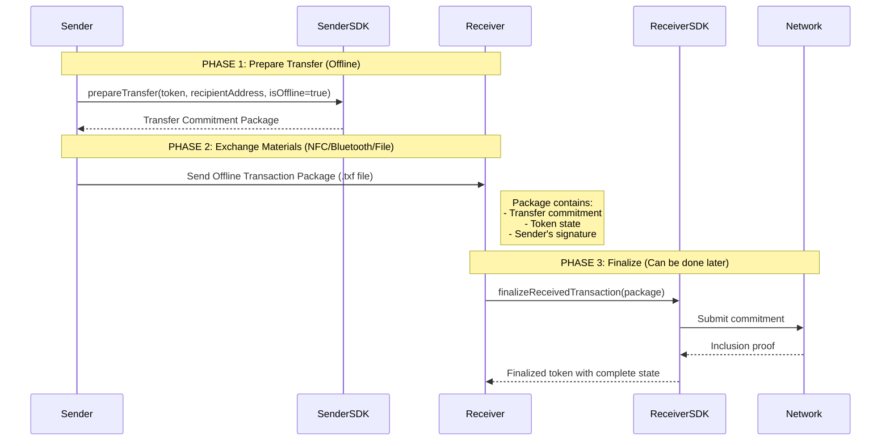

# 📘 TXF Implementation Guide for TypeScript Wallets

## 🏗️ Architecture Overview

### TXF File Format Specification v2.0

The Token eXchange Format (TXF) is a JSON-based file format for token portability:

```typescript
// Core TXF structure that both wallets must implement
interface TxfToken {
  // Required fields
  version: string;           // "2.0"
  id: string;               // Hex string token ID
  type: string;             // "fungible" | "nft" | "nametag"
  state: {
    data: string | null;
    unlockPredicate: {
      type: "masked" | "unmasked";
      reference?: string;   // For masked
      publicKey?: string;   // For unmasked
    };
  };
  genesis: {
    data: {
      tokenId: string;
      tokenType: string;
      tokenData?: string;
      recipient?: string;
    };
  };
  transactions: Transaction[];

  // Optional fields for pending transfers
  isOfflineTransfer?: boolean;
  pendingOfflineData?: string;  // JSON string of OfflineTransactionPackage
  status?: "PENDING" | "SUBMITTED" | "CONFIRMED" | "TRANSFERRED" | "BURNED" | "FAILED";

  // Optional metadata
  nametagTokens?: any[];
  amount?: string;          // BigInt as string
  coinId?: string;         // Hex string
  symbol?: string;         // e.g., "UNIT"
  data?: string;           // Hex-encoded token data
}
```

### Token Lifecycle States

| Status | Description | Next Actions |
|--------|-------------|--------------|
| `PENDING` | Offline transfer received but not submitted to network | Submit to network when online |
| `SUBMITTED` | Submitted to network, waiting for confirmation | Wait for inclusion proof |
| `CONFIRMED` | Confirmed on network | Ready for use or transfer |
| `TRANSFERRED` | Token sent to another wallet (archived) | None - token is spent |
| `BURNED` | Token burned (split/swap) | None - token destroyed |
| `FAILED` | Network submission failed | Retry submission or cancel |

### Protocol Flow Diagram



## 🌐 HTML Wallet Implementation

### Core Implementation Class

```typescript
// src/services/TxfService.ts
export class TxfService {
  private readonly VERSION = "2.0";

  constructor(
    private sdk: UnicitySDK  // Your existing TypeScript SDK instance
  ) {}

  /**
   * Export token to TXF format for download
   */
  async exportToken(token: Token): Promise<Blob> {
    const txfToken: TxfToken = {
      version: this.VERSION,
      id: token.id,
      type: token.type,
      state: token.state,
      genesis: token.genesis,
      transactions: token.transactions || [],
      // Include pending data if exists
      isOfflineTransfer: token.isOfflineTransfer,
      pendingOfflineData: token.pendingOfflineData,
      status: token.status,
      // Metadata
      amount: token.amount?.toString(),
      symbol: token.symbol,
      data: token.data
    };

    const json = JSON.stringify(txfToken, null, 2);
    return new Blob([json], { type: 'application/json' });
  }

  /**
   * Import token from uploaded TXF file
   */
  async importToken(file: File): Promise<Token> {
    // Validate file extension
    if (!file.name.endsWith('.txf')) {
      throw new Error('Invalid file format. Expected .txf file');
    }

    const text = await file.text();
    const txfToken: TxfToken = JSON.parse(text);

    // Validate structure
    this.validateTxfToken(txfToken);

    // Check if it has pending transactions
    if (txfToken.isOfflineTransfer && txfToken.pendingOfflineData) {
      return await this.processPendingToken(txfToken);
    }

    // Return as regular token
    return this.convertToSdkToken(txfToken);
  }

  /**
   * Process token with pending offline transaction
   */
  private async processPendingToken(txfToken: TxfToken): Promise<Token> {
    const pendingData = JSON.parse(txfToken.pendingOfflineData!);

    // Get receiver identity from wallet
    const receiverIdentity = await this.sdk.getIdentity();

    // Complete the offline transfer
    const finalizedToken = await this.sdk.completeOfflineTransfer(
      receiverIdentity,
      pendingData
    );

    return finalizedToken;
  }

  /**
   * Prepare offline transfer (sender side)
   */
  async prepareOfflineTransfer(
    token: Token,
    recipientAddress: string
  ): Promise<TxfToken> {
    const senderIdentity = await this.sdk.getIdentity();

    // Prepare transfer commitment
    const transferPackage = await this.sdk.prepareTransfer({
      senderIdentity,
      recipientAddress,
      token,
      isOffline: true  // Critical flag
    });

    // Create TXF with pending data
    const txfToken: TxfToken = {
      ...this.convertToTxfToken(token),
      isOfflineTransfer: true,
      pendingOfflineData: JSON.stringify(transferPackage),
      status: "PENDING"
    };

    return txfToken;
  }

  private validateTxfToken(token: TxfToken): void {
    if (token.version !== this.VERSION) {
      console.warn(`Version mismatch: expected ${this.VERSION}, got ${token.version}`);
    }

    if (!token.id || !token.state || !token.genesis) {
      throw new Error('Invalid TXF token: missing required fields');
    }

    // Validate hex strings
    if (!/^[0-9a-fA-F]+$/.test(token.id)) {
      throw new Error('Invalid token ID format');
    }
  }
}
```

### HTML UI Components

```typescript
// src/components/TokenExchange.tsx
import React, { useState, useRef } from 'react';
import { TxfService } from '../services/TxfService';

export const TokenExchangeComponent: React.FC = () => {
  const [importing, setImporting] = useState(false);
  const fileInputRef = useRef<HTMLInputElement>(null);
  const txfService = new TxfService(sdk);

  // Export token to TXF
  const handleExport = async (token: Token) => {
    try {
      const blob = await txfService.exportToken(token);

      // Create download link
      const url = URL.createObjectURL(blob);
      const a = document.createElement('a');
      a.href = url;
      a.download = `token_${token.name || token.id}_${Date.now()}.txf`;
      a.click();

      URL.revokeObjectURL(url);

      toast.success('Token exported successfully');
    } catch (error) {
      toast.error(`Export failed: ${error.message}`);
    }
  };

  // Import token from TXF
  const handleImport = async (event: React.ChangeEvent<HTMLInputElement>) => {
    const file = event.target.files?.[0];
    if (!file) return;

    setImporting(true);
    try {
      const token = await txfService.importToken(file);

      // Add to wallet
      await walletStore.addToken(token);

      toast.success(`Token ${token.name || token.id} imported successfully`);

      // Check if needs network submission
      if (token.status === 'PENDING') {
        const submit = await confirmDialog(
          'This token has a pending transaction. Submit to network now?'
        );

        if (submit) {
          await submitPendingTransaction(token);
        }
      }
    } catch (error) {
      toast.error(`Import failed: ${error.message}`);
    } finally {
      setImporting(false);
      if (fileInputRef.current) {
        fileInputRef.current.value = '';
      }
    }
  };

  // Prepare offline transfer
  const handleOfflineTransfer = async (token: Token) => {
    const recipientAddress = await promptDialog('Enter recipient address:');
    if (!recipientAddress) return;

    try {
      const txfToken = await txfService.prepareOfflineTransfer(
        token,
        recipientAddress
      );

      // Export as TXF for sharing
      const blob = new Blob(
        [JSON.stringify(txfToken, null, 2)],
        { type: 'application/json' }
      );

      const url = URL.createObjectURL(blob);
      const a = document.createElement('a');
      a.href = url;
      a.download = `transfer_${token.id}_${Date.now()}.txf`;
      a.click();

      toast.success('Offline transfer prepared. Share the file with recipient.');
    } catch (error) {
      toast.error(`Transfer preparation failed: ${error.message}`);
    }
  };

  return (
    <div className="token-exchange">
      <input
        ref={fileInputRef}
        type="file"
        accept=".txf"
        onChange={handleImport}
        style={{ display: 'none' }}
      />

      <button
        onClick={() => fileInputRef.current?.click()}
        disabled={importing}
      >
        {importing ? 'Importing...' : 'Import Token (.txf)'}
      </button>

      {/* Token list with export buttons */}
      {tokens.map(token => (
        <div key={token.id} className="token-item">
          <span>{token.name}</span>
          <button onClick={() => handleExport(token)}>
            Export
          </button>
          <button onClick={() => handleOfflineTransfer(token)}>
            Prepare Offline Transfer
          </button>
        </div>
      ))}
    </div>
  );
};
```

## 💻 CLI Wallet Implementation

### Core CLI Implementation

```typescript
// src/cli/txf-commands.ts
import { Command } from 'commander';
import * as fs from 'fs/promises';
import * as path from 'path';
import * as chalk from 'chalk';
import { TxfService } from '../services/TxfService';

export function registerTxfCommands(program: Command, sdk: UnicitySDK) {
  const txfService = new TxfService(sdk);

  // Export command
  program
    .command('export <tokenId>')
    .description('Export token to TXF file')
    .option('-o, --output <path>', 'Output file path')
    .option('--offline-transfer <address>', 'Prepare offline transfer to address')
    .action(async (tokenId, options) => {
      try {
        console.log(chalk.blue('📦 Exporting token...'));

        // Get token from wallet
        const token = await sdk.getToken(tokenId);
        if (!token) {
          throw new Error(`Token ${tokenId} not found`);
        }

        let txfToken: TxfToken;

        if (options.offlineTransfer) {
          // Prepare offline transfer
          console.log(chalk.yellow('🔄 Preparing offline transfer...'));
          txfToken = await txfService.prepareOfflineTransfer(
            token,
            options.offlineTransfer
          );
        } else {
          // Regular export
          txfToken = txfService.convertToTxfToken(token);
        }

        // Determine output path
        const outputPath = options.output ||
          `token_${tokenId.substring(0, 8)}_${Date.now()}.txf`;

        // Write to file
        await fs.writeFile(
          outputPath,
          JSON.stringify(txfToken, null, 2),
          'utf-8'
        );

        console.log(chalk.green(`✅ Token exported to ${outputPath}`));

        if (options.offlineTransfer) {
          console.log(chalk.yellow(
            '📤 Share this file with the recipient to complete the transfer'
          ));
        }
      } catch (error) {
        console.error(chalk.red(`❌ Export failed: ${error.message}`));
        process.exit(1);
      }
    });

  // Import command
  program
    .command('import <filepath>')
    .description('Import token from TXF file')
    .option('--submit', 'Auto-submit pending transactions')
    .option('--validate-only', 'Only validate without importing')
    .action(async (filepath, options) => {
      try {
        console.log(chalk.blue('📥 Importing token...'));

        // Read file
        const content = await fs.readFile(filepath, 'utf-8');
        const txfToken: TxfToken = JSON.parse(content);

        // Validate
        const validation = await txfService.validate(txfToken);

        if (!validation.isValid) {
          console.error(chalk.red('❌ Validation failed:'));
          validation.errors?.forEach(err =>
            console.error(chalk.red(`   - ${err}`))
          );
          process.exit(1);
        }

        console.log(chalk.green('✅ Token validation passed'));

        if (options.validateOnly) {
          console.log(chalk.blue('Token Details:'));
          console.log(`  ID: ${txfToken.id}`);
          console.log(`  Type: ${txfToken.type}`);
          console.log(`  Status: ${txfToken.status || 'CONFIRMED'}`);
          console.log(`  Has Pending TX: ${!!txfToken.isOfflineTransfer}`);
          return;
        }

        // Process token
        if (txfToken.isOfflineTransfer && txfToken.pendingOfflineData) {
          console.log(chalk.yellow('🔄 Processing offline transaction...'));

          const receiverIdentity = await sdk.getIdentity();
          const pendingData = JSON.parse(txfToken.pendingOfflineData);

          const finalizedToken = await sdk.completeOfflineTransfer(
            receiverIdentity,
            pendingData
          );

          if (options.submit) {
            console.log(chalk.blue('📡 Submitting to network...'));
            await sdk.submitPendingTransaction(finalizedToken);
            console.log(chalk.green('✅ Transaction confirmed on network'));
          } else {
            console.log(chalk.yellow(
              '⏸️  Token imported with pending transaction. ' +
              'Use "wallet submit-pending" to finalize'
            ));
          }

          // Save to wallet
          await sdk.addToken(finalizedToken);
        } else {
          // Regular import
          const token = txfService.convertToSdkToken(txfToken);
          await sdk.addToken(token);
        }

        console.log(chalk.green('✅ Token imported successfully'));

      } catch (error) {
        console.error(chalk.red(`❌ Import failed: ${error.message}`));
        process.exit(1);
      }
    });

  // List pending transactions
  program
    .command('list-pending')
    .description('List all pending offline transactions')
    .action(async () => {
      try {
        const tokens = await sdk.getTokens();
        const pending = tokens.filter(t =>
          t.status === 'PENDING' || t.isOfflineTransfer
        );

        if (pending.length === 0) {
          console.log(chalk.gray('No pending transactions'));
          return;
        }

        console.log(chalk.blue('📋 Pending Transactions:'));
        pending.forEach(token => {
          console.log(`\n  Token: ${token.id.substring(0, 8)}...`);
          console.log(`  Name: ${token.name || 'Unnamed'}`);
          console.log(`  Status: ${chalk.yellow(token.status)}`);
          console.log(`  Amount: ${token.amount || 'N/A'}`);
        });

        console.log(chalk.gray(
          '\nUse "wallet submit-pending <tokenId>" to submit to network'
        ));

      } catch (error) {
        console.error(chalk.red(`❌ Failed to list pending: ${error.message}`));
        process.exit(1);
      }
    });

  // Submit pending transaction
  program
    .command('submit-pending <tokenId>')
    .description('Submit pending offline transaction to network')
    .action(async (tokenId) => {
      try {
        console.log(chalk.blue('📡 Submitting pending transaction...'));

        const token = await sdk.getToken(tokenId);
        if (!token) {
          throw new Error(`Token ${tokenId} not found`);
        }

        if (!token.isOfflineTransfer || !token.pendingOfflineData) {
          throw new Error('Token has no pending transaction');
        }

        // Submit to network
        const result = await sdk.submitPendingTransaction(token);

        console.log(chalk.green('✅ Transaction submitted successfully'));
        console.log(`  Transaction ID: ${result.transactionId}`);
        console.log(`  Status: ${result.status}`);

      } catch (error) {
        console.error(chalk.red(`❌ Submission failed: ${error.message}`));
        process.exit(1);
      }
    });

  // Batch operations
  program
    .command('batch-import <directory>')
    .description('Import all TXF files from a directory')
    .option('--recursive', 'Include subdirectories')
    .action(async (directory, options) => {
      try {
        console.log(chalk.blue(`📁 Scanning ${directory}...`));

        const files = await findTxfFiles(directory, options.recursive);

        if (files.length === 0) {
          console.log(chalk.gray('No TXF files found'));
          return;
        }

        console.log(chalk.blue(`Found ${files.length} TXF files`));

        let imported = 0;
        let failed = 0;

        for (const file of files) {
          try {
            console.log(chalk.gray(`  Processing ${path.basename(file)}...`));

            const content = await fs.readFile(file, 'utf-8');
            const txfToken = JSON.parse(content);

            const token = await txfService.importToken(txfToken);
            await sdk.addToken(token);

            imported++;
          } catch (error) {
            console.error(chalk.red(`    Failed: ${error.message}`));
            failed++;
          }
        }

        console.log(chalk.green(
          `\n✅ Batch import complete: ${imported} imported, ${failed} failed`
        ));

      } catch (error) {
        console.error(chalk.red(`❌ Batch import failed: ${error.message}`));
        process.exit(1);
      }
    });
}

// Helper function to find TXF files
async function findTxfFiles(
  directory: string,
  recursive: boolean = false
): Promise<string[]> {
  const files: string[] = [];

  const entries = await fs.readdir(directory, { withFileTypes: true });

  for (const entry of entries) {
    const fullPath = path.join(directory, entry.name);

    if (entry.isDirectory() && recursive) {
      files.push(...await findTxfFiles(fullPath, recursive));
    } else if (entry.isFile() && entry.name.endsWith('.txf')) {
      files.push(fullPath);
    }
  }

  return files;
}
```

### CLI Usage Examples

```bash
# Export a token to TXF file
wallet export token123 -o my-token.txf

# Export with offline transfer preparation
wallet export token123 --offline-transfer recipient_address_456

# Import a token from TXF file
wallet import ./received-token.txf

# Import and auto-submit pending transactions
wallet import ./received-token.txf --submit

# Validate a TXF file without importing
wallet import ./token.txf --validate-only

# List all pending transactions
wallet list-pending

# Submit a specific pending transaction
wallet submit-pending token123

# Batch import all TXF files from a directory
wallet batch-import ./tokens-folder --recursive
```

## 🛠️ Shared TypeScript Utilities

### Complete TxfService Implementation

```typescript
// src/services/TxfService.ts - Complete implementation
export class TxfService {
  private readonly VERSION = "2.0";
  private readonly FILE_EXTENSION = ".txf";

  constructor(private sdk: UnicitySDK) {}

  /**
   * Convert SDK token to TXF format
   */
  convertToTxfToken(token: Token): TxfToken {
    return {
      version: this.VERSION,
      id: token.id,
      type: token.type,
      state: token.state,
      genesis: token.genesis,
      transactions: token.transactions || [],
      // Optional fields
      isOfflineTransfer: token.isOfflineTransfer,
      pendingOfflineData: token.pendingOfflineData,
      status: token.status,
      amount: token.amount?.toString(),
      symbol: token.symbol,
      coinId: token.coinId,
      data: token.data,
      nametagTokens: token.nametagTokens
    };
  }

  /**
   * Convert TXF token to SDK format
   */
  convertToSdkToken(txfToken: TxfToken): Token {
    return {
      id: txfToken.id,
      type: txfToken.type,
      state: txfToken.state,
      genesis: txfToken.genesis,
      transactions: txfToken.transactions,
      // Convert amount string back to BigInt
      amount: txfToken.amount ? BigInt(txfToken.amount) : undefined,
      // Preserve other fields
      isOfflineTransfer: txfToken.isOfflineTransfer,
      pendingOfflineData: txfToken.pendingOfflineData,
      status: txfToken.status,
      symbol: txfToken.symbol,
      coinId: txfToken.coinId,
      data: txfToken.data,
      nametagTokens: txfToken.nametagTokens
    };
  }

  /**
   * Validate TXF token structure
   */
  async validate(txfToken: TxfToken): Promise<ValidationResult> {
    const errors: string[] = [];
    const warnings: string[] = [];

    // Check version
    if (txfToken.version !== this.VERSION) {
      warnings.push(
        `Version mismatch: expected ${this.VERSION}, got ${txfToken.version}`
      );
    }

    // Required fields
    if (!txfToken.id) errors.push("Missing required field: id");
    if (!txfToken.type) errors.push("Missing required field: type");
    if (!txfToken.state) errors.push("Missing required field: state");
    if (!txfToken.genesis) errors.push("Missing required field: genesis");

    // Validate hex strings
    if (txfToken.id && !/^[0-9a-fA-F]+$/.test(txfToken.id)) {
      errors.push("Invalid token ID format (must be hex)");
    }

    // Validate unlock predicate
    if (txfToken.state?.unlockPredicate) {
      const predicate = txfToken.state.unlockPredicate;
      if (!["masked", "unmasked"].includes(predicate.type)) {
        errors.push(`Invalid unlock predicate type: ${predicate.type}`);
      }

      if (predicate.type === "masked" && !predicate.reference) {
        errors.push("Masked predicate missing reference");
      }

      if (predicate.type === "unmasked" && !predicate.publicKey) {
        errors.push("Unmasked predicate missing publicKey");
      }
    }

    // Validate transactions timeline
    if (txfToken.transactions && txfToken.transactions.length > 1) {
      for (let i = 1; i < txfToken.transactions.length; i++) {
        const prev = txfToken.transactions[i - 1];
        const curr = txfToken.transactions[i];

        if (curr.timestamp < prev.timestamp) {
          errors.push(
            `Transaction timeline error at index ${i}: timestamps not sequential`
          );
        }
      }
    }

    // Check pending data consistency
    if (txfToken.isOfflineTransfer && !txfToken.pendingOfflineData) {
      errors.push("Offline transfer flag set but no pending data");
    }

    return {
      isValid: errors.length === 0,
      errors: errors.length > 0 ? errors : undefined,
      warnings: warnings.length > 0 ? warnings : undefined,
      hasOfflineTransfer: !!txfToken.isOfflineTransfer,
      status: txfToken.status
    };
  }

  /**
   * Handle token splitting for partial transfers
   */
  async prepareSplitTransfer(
    token: Token,
    amount: bigint,
    recipientAddress: string
  ): Promise<SplitTransferResult> {
    const totalAmount = token.amount;
    if (!totalAmount || amount > totalAmount) {
      throw new Error("Insufficient token amount for split");
    }

    const remainderAmount = totalAmount - amount;

    // Use SDK to prepare split
    const splitResult = await this.sdk.splitToken({
      token,
      amounts: [amount, remainderAmount],
      recipients: [recipientAddress, await this.sdk.getOwnAddress()]
    });

    // Prepare offline transfer for recipient portion
    const recipientTxf = await this.prepareOfflineTransfer(
      splitResult.tokens[0],
      recipientAddress
    );

    return {
      recipientTxf,
      remainderToken: splitResult.tokens[1],
      burnedTokenId: token.id
    };
  }
}
```

### Type Definitions

```typescript
// src/types/txf.types.ts

export interface TxfToken {
  // Required fields
  version: string;
  id: string;
  type: string;
  state: TokenState;
  genesis: GenesisData;
  transactions: Transaction[];

  // Optional fields for pending transfers
  isOfflineTransfer?: boolean;
  pendingOfflineData?: string;
  status?: TokenStatus;

  // Optional metadata
  nametagTokens?: any[];
  amount?: string;
  coinId?: string;
  symbol?: string;
  data?: string;
}

export interface TokenState {
  data: string | null;
  unlockPredicate: UnlockPredicate;
}

export type UnlockPredicate = MaskedPredicate | UnmaskedPredicate;

export interface MaskedPredicate {
  type: 'masked';
  reference: string;
}

export interface UnmaskedPredicate {
  type: 'unmasked';
  publicKey: string;
}

export interface GenesisData {
  data: {
    tokenId: string;
    tokenType: string;
    tokenData?: string;
    recipient?: string;
  };
}

export interface Transaction {
  id: string;
  type: 'mint' | 'transfer' | 'burn' | 'split';
  timestamp: number;
  data: any;
  inclusionProof?: any;
}

export type TokenStatus =
  | 'PENDING'
  | 'SUBMITTED'
  | 'CONFIRMED'
  | 'TRANSFERRED'
  | 'BURNED'
  | 'FAILED';

export interface ValidationResult {
  isValid: boolean;
  errors?: string[];
  warnings?: string[];
  hasOfflineTransfer: boolean;
  status?: TokenStatus;
}

export interface SplitTransferResult {
  recipientTxf: TxfToken;
  remainderToken: Token;
  burnedTokenId: string;
}

export interface OfflineTransactionPackage {
  commitment: any;
  senderIdentity?: {
    publicKey: string;
  };
  receiverAddress: string;
  tokenMetadata: {
    name: string;
    type: string;
    amount?: string;
  };
}
```

## 🧪 Testing Strategies

### Unit Tests

```typescript
// tests/txf.test.ts
import { describe, it, expect, beforeEach } from '@jest/globals';
import { TxfService } from '../src/services/TxfService';
import { MockUnicitySDK } from './mocks/MockUnicitySDK';

describe('TXF Service', () => {
  let service: TxfService;
  let mockSdk: MockUnicitySDK;

  beforeEach(() => {
    mockSdk = new MockUnicitySDK();
    service = new TxfService(mockSdk);
  });

  describe('Token Export/Import', () => {
    it('should export token to TXF format', async () => {
      const token = createTestToken();
      const txfToken = service.convertToTxfToken(token);

      expect(txfToken.version).toBe('2.0');
      expect(txfToken.id).toBe(token.id);
      expect(txfToken.type).toBe(token.type);
      expect(txfToken.state).toEqual(token.state);
    });

    it('should import TXF token', async () => {
      const txfToken = createTestTxfToken();
      const token = service.convertToSdkToken(txfToken);

      expect(token.id).toBe(txfToken.id);
      expect(token.amount).toBe(BigInt(txfToken.amount!));
    });

    it('should handle offline transfer preparation', async () => {
      const token = createTestToken();
      const recipientAddress = 'recipient_addr_123';

      mockSdk.prepareTransfer = jest.fn().mockResolvedValue({
        commitment: 'test_commitment_data',
        transactionData: {}
      });

      const txfToken = await service.prepareOfflineTransfer(
        token,
        recipientAddress
      );

      expect(txfToken.isOfflineTransfer).toBe(true);
      expect(txfToken.status).toBe('PENDING');
      expect(txfToken.pendingOfflineData).toBeDefined();
    });
  });

  describe('Validation', () => {
    it('should validate correct TXF token', async () => {
      const txfToken = createTestTxfToken();
      const result = await service.validate(txfToken);

      expect(result.isValid).toBe(true);
      expect(result.errors).toBeUndefined();
    });

    it('should detect missing required fields', async () => {
      const invalidToken = { version: '2.0' } as any;
      const result = await service.validate(invalidToken);

      expect(result.isValid).toBe(false);
      expect(result.errors).toContain('Missing required field: id');
    });

    it('should validate hex format', async () => {
      const txfToken = createTestTxfToken();
      txfToken.id = 'not-hex!';

      const result = await service.validate(txfToken);

      expect(result.isValid).toBe(false);
      expect(result.errors).toContain(
        'Invalid token ID format (must be hex)'
      );
    });
  });
});
```

### Integration Tests

```typescript
// tests/integration/txf-flow.test.ts
describe('TXF Complete Flow', () => {
  it('should handle complete offline transfer flow', async () => {
    // 1. Sender creates token
    const senderSdk = new UnicitySDK(senderConfig);
    const token = await senderSdk.mintToken(/* ... */);

    // 2. Sender prepares offline transfer
    const txfService = new TxfService(senderSdk);
    const txfToken = await txfService.prepareOfflineTransfer(
      token,
      recipientAddress
    );

    // 3. Export to file
    const filepath = './test-transfer.txf';
    await fs.writeFile(filepath, JSON.stringify(txfToken));

    // 4. Receiver imports file
    const receiverSdk = new UnicitySDK(receiverConfig);
    const receiverTxfService = new TxfService(receiverSdk);

    const importedTxf = JSON.parse(
      await fs.readFile(filepath, 'utf-8')
    );

    // 5. Receiver processes offline transfer
    const receivedToken = await receiverTxfService.processOfflineTransfer(
      importedTxf
    );

    expect(receivedToken.status).toBe('PENDING');

    // 6. Submit to network
    const finalToken = await receiverSdk.submitPendingTransaction(
      receivedToken
    );

    expect(finalToken.status).toBe('CONFIRMED');

    // Cleanup
    await fs.unlink(filepath);
  });
});
```

## 🔒 Security Best Practices

### Private Key Management

```typescript
// src/security/SecureStorage.ts
export class SecureTokenStorage {
  /**
   * NEVER include private keys in TXF files
   */
  sanitizeTxfForExport(txfToken: TxfToken): TxfToken {
    // Remove any sensitive data
    const sanitized = { ...txfToken };

    // Ensure no private keys in pending data
    if (sanitized.pendingOfflineData) {
      const pendingData = JSON.parse(sanitized.pendingOfflineData);
      delete pendingData.senderIdentity?.privateKey;
      delete pendingData.receiverIdentity?.privateKey;
      sanitized.pendingOfflineData = JSON.stringify(pendingData);
    }

    return sanitized;
  }

  /**
   * Validate imported tokens don't contain private keys
   */
  validateNoPrivateKeys(txfToken: TxfToken): void {
    const json = JSON.stringify(txfToken);

    // Check for common private key patterns
    const privateKeyPatterns = [
      /privateKey/i,
      /secretKey/i,
      /private_key/i,
      /secret/i,
      /mnemonic/i
    ];

    for (const pattern of privateKeyPatterns) {
      if (pattern.test(json)) {
        throw new Error(
          'Security violation: TXF file contains potential private key data'
        );
      }
    }
  }
}
```

### File Handling Security

```typescript
// src/security/FileValidator.ts
export class TxfFileValidator {
  private readonly MAX_FILE_SIZE = 10 * 1024 * 1024; // 10MB max
  private readonly ALLOWED_EXTENSION = '.txf';

  /**
   * Validate file before processing
   */
  async validateFile(file: File | string): Promise<void> {
    let stats: any;
    let filename: string;

    if (typeof file === 'string') {
      // CLI path
      const fs = await import('fs');
      stats = await fs.promises.stat(file);
      filename = file;
    } else {
      // Browser File object
      stats = { size: file.size };
      filename = file.name;
    }

    // Check extension
    if (!filename.endsWith(this.ALLOWED_EXTENSION)) {
      throw new Error(
        `Invalid file extension. Expected ${this.ALLOWED_EXTENSION}`
      );
    }

    // Check size
    if (stats.size > this.MAX_FILE_SIZE) {
      throw new Error(
        `File too large. Maximum size: ${this.MAX_FILE_SIZE} bytes`
      );
    }
  }
}
```

## 📋 Implementation Checklist

### HTML Wallet
- [ ] Implement `TxfService` class
- [ ] Add file upload/download UI components
- [ ] Handle offline transfer preparation
- [ ] Process pending transactions
- [ ] Add validation and error handling
- [ ] Implement secure storage (IndexedDB)
- [ ] Add progress indicators for long operations
- [ ] Test with various TXF file sizes

### CLI Wallet
- [ ] Implement CLI commands (export, import, etc.)
- [ ] Add interactive mode with inquirer
- [ ] Support batch operations
- [ ] Implement QR code generation/scanning
- [ ] Add verbose logging options
- [ ] Handle network errors gracefully
- [ ] Support configuration files
- [ ] Add shell completion scripts

### Both Wallets
- [ ] Validate TXF structure on import
- [ ] Sanitize exports (remove private keys)
- [ ] Handle version compatibility
- [ ] Implement compression for large tokens
- [ ] Add comprehensive error messages
- [ ] Write unit and integration tests
- [ ] Document API methods
- [ ] Create user guides

## 🎯 Summary

This documentation provides a complete implementation guide for TXF (Token eXchange Format) functionality in both HTML and CLI wallets using TypeScript. The key points to remember:

### Core Requirements

1. **TXF Format**: JSON files with `.txf` extension containing complete token state
2. **Offline Support**: Tokens can include pending transactions in `pendingOfflineData`
3. **Status Tracking**: PENDING → SUBMITTED → CONFIRMED workflow
4. **Split Support**: Handle partial transfers with token splitting

### Critical Implementation Steps

1. **Export Flow**:
   - Convert SDK token to TXF format
   - Optionally prepare offline transfer commitment
   - Save as `.txf` file

2. **Import Flow**:
   - Validate file extension and structure
   - Check for pending transactions
   - Process offline transfers if needed
   - Add to wallet

3. **Offline Transfer**:
   - Call `sdk.prepareTransfer(isOffline: true)`
   - Include commitment in TXF export
   - Receiver calls `sdk.completeOfflineTransfer()`
   - Submit to network when online

### Security Essentials

- **Never** include private keys in TXF files
- Validate all imported files for malicious content
- Implement rate limiting for network submissions
- Use secure storage (IndexedDB for browser, encrypted files for CLI)
- Sanitize file paths to prevent directory traversal

### Next Steps

1. Start with the `TxfService` class implementation
2. Add UI/CLI commands for import/export
3. Test with sample TXF files from the Android wallet
4. Implement offline transfer support
5. Add comprehensive error handling
6. Write tests for all scenarios

The implementation leverages your existing TypeScript SDK and adds TXF as a transport layer for token portability, enabling seamless token exchange between wallets even without network connectivity.